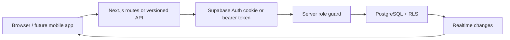
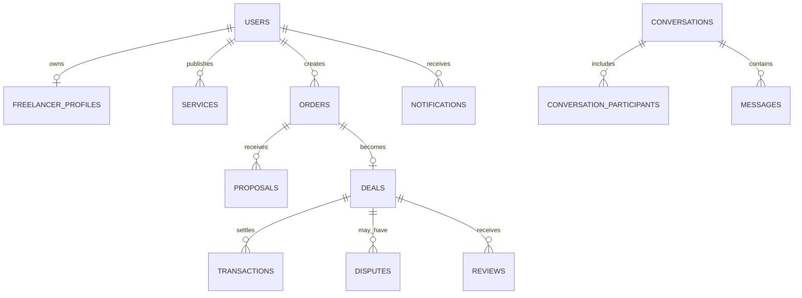

# Architecture notes

## Request and authorization path

The browser uses a publishable key and receives only rows allowed by RLS.
Privileged moderation and payment orchestration use a server-only client after
their own role/input checks.

## Core marketplace relationships

## Boundaries

- `app`: transport and rendering. Business rules should not accumulate here.
- `features`: use cases and provider contracts.
- `entities`: domain vocabulary shared between features.
- `shared`: framework integration and reusable primitives with no marketplace
  feature ownership.
- PostgreSQL: integrity, ownership and row authorization.

Chat messages are cursor-paginated by `(created_at, id)`. Realtime is a delivery
optimization, not the source of truth; reconnects must fetch missed rows.

The payment event inbox is private. Raw payload retention and redaction must be
agreed with each provider and local compliance requirements before launch.
